# Power BI Snowflake Semantic Views Connector

A Power BI custom connector that brings Snowflake Semantic Views directly into your reports with full DirectQuery support. Query your semantic layer in real-time without data extracts or imports.

This connector was built to bridge the gap between Snowflake's semantic layer and Power BI's visualization capabilities. It translates Power BI's queries into standard SQL that Snowflake's semantic layer understands, so you can focus on building reports rather than writing SQL.

## Table of Contents

- [How It Works](#how-it-works)
- [What's Included](#whats-included)
- [Features](#features)
- [Requirements](#requirements)
- [Installation](#installation)
- [Using the Connector](#using-the-connector)
- [PBIT Generator App](#pbit-generator-app)
- [Sample Data](#sample-data)
- [Known Limitations](#known-limitations)
- [Troubleshooting](#troubleshooting)
- [Version](#version)
- [License](#license)

## How It Works

```
┌─────────────────────┐     ┌──────────────────────┐     ┌─────────────────────┐
│                     │     │                      │     │                     │
│   Power BI Desktop  │─────│   Custom Connector   │─────│     Snowflake       │
│                     │     │   (.mez file)        │     │                     │
│   - DirectQuery     │     │                      │     │   - Semantic Views  │
│   - Drag & drop     │     │   - Translates to    │     │   - DIMENSIONS      │
│   - Visualizations  │     │     standard SQL     │     │   - METRICS         │
│                     │     │   - Handles AGG()    │     │   - FACTS           │
│                     │     │   - Auth management  │     │                     │
└─────────────────────┘     └──────────────────────┘     └─────────────────────┘
```


The connector generates standard SQL queries against your semantic views. When you drag a metric onto a report, Power BI asks for aggregated data. The connector translates this into a query like:

```sql
SELECT "Region", "Product_Category", AGG("Total_Sales"), AGG("Order_Count")
FROM MY_DATABASE.MY_SCHEMA.SALES_SEMANTIC_VIEW
WHERE "Region" = 'North America'
GROUP BY "Region", "Product_Category"
ORDER BY "Region"
LIMIT 1000
```

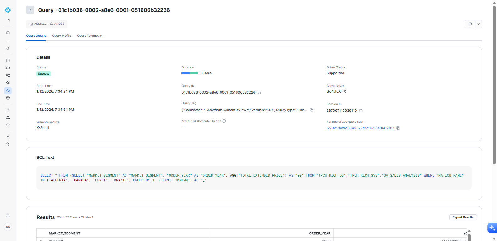
**The connector generates standard SQL queries visible in Snowflake's query history**

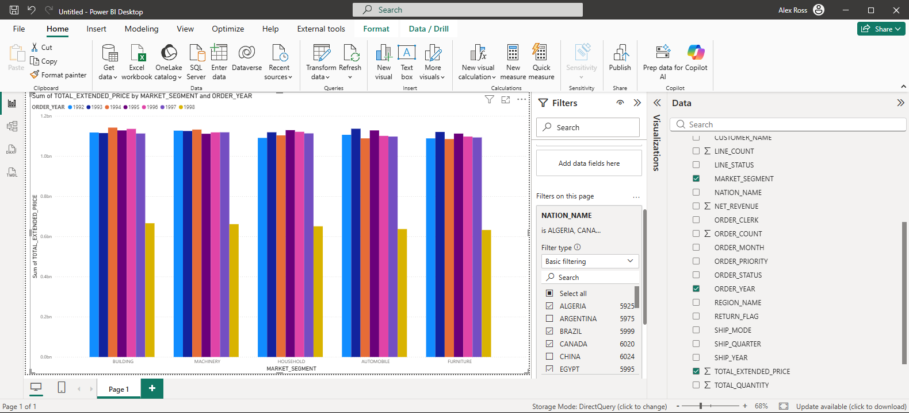
**A DirectQuery report powered by Snowflake Semantic Views**

Semantic views support standard SQL clauses including SELECT, WHERE, GROUP BY, ORDER BY, and LIMIT. The key difference is that metrics must be wrapped in the [`AGG()` function](https://docs.snowflake.com/en/user-guide/views-semantic/querying), which tells Snowflake to apply the metric's predefined aggregation logic. Dimensions and facts are selected normally without AGG().

This means you get all the flexibility of SQL—filtering, sorting, grouping, pagination—while the semantic layer ensures consistent metric calculations across all your reports.

## What's Included

```
root/
├── connector/
│   ├── SnowflakeSemanticViews.mez          # Power BI custom connector
│   └── SnowflakeSemanticViewsConnector.msi # Windows installer
├── img/                                    # Screenshots
├── streamlit/                              # PBIT Generator web application
└── tpch_sample_data/                       # Sample Snowflake scripts for testing
```

## Features

- **DirectQuery Support** - Query Snowflake in real-time. No scheduled refreshes, no stale data.
- **Full Semantic Views Support** - Works with DIMENSIONS, METRICS, and FACTS as defined in your semantic layer.
- **Multiple Authentication Methods** - OAuth, username/password, and key-pair authentication.
- **Enterprise-Ready Installer** - MSI package for IT-managed deployments with silent install support.
- **PBIT Generator** - Companion Streamlit app that creates ready-to-use Power BI template files.

## Requirements

- Power BI Desktop (January 2024 or later recommended)
- Snowflake account with [Semantic Views](https://docs.snowflake.com/en/user-guide/views-semantic/overview) and standard SQL support enabled ([Enterprise Edition](https://docs.snowflake.com/en/user-guide/intro-editions) or higher)
- Appropriate Snowflake role with SELECT permissions on your semantic views

## Installation

### Option 1: MSI Installer (Recommended)

The installer handles everything automatically:

1. Close Power BI Desktop if it's running
2. Run `connector/SnowflakeSemanticViewsConnector.msi`
3. Follow the installation prompts
4. Restart Power BI Desktop

For silent installation (useful for enterprise deployment):
```
msiexec /i SnowflakeSemanticViewsConnector.msi /qn
```

### Option 2: Manual Installation

If you prefer manual installation or need to install on a non-standard path:

1. Copy `connector/SnowflakeSemanticViews.mez` to your Custom Connectors folder:
   - Windows: `C:\Users\<username>\Documents\Power BI Desktop\Custom Connectors\`
   - Create the folder if it doesn't exist
2. Restart Power BI Desktop
3. Go to File > Options > Security > Data Extensions
4. Select "Allow any extension to load without validation" (or add to your [trusted extensions](https://learn.microsoft.com/en-us/power-bi/connect-data/desktop-connector-extensibility))

## Using the Connector

1. In Power BI Desktop, click **Get Data**
2. Search for "Snowflake Semantic Views"

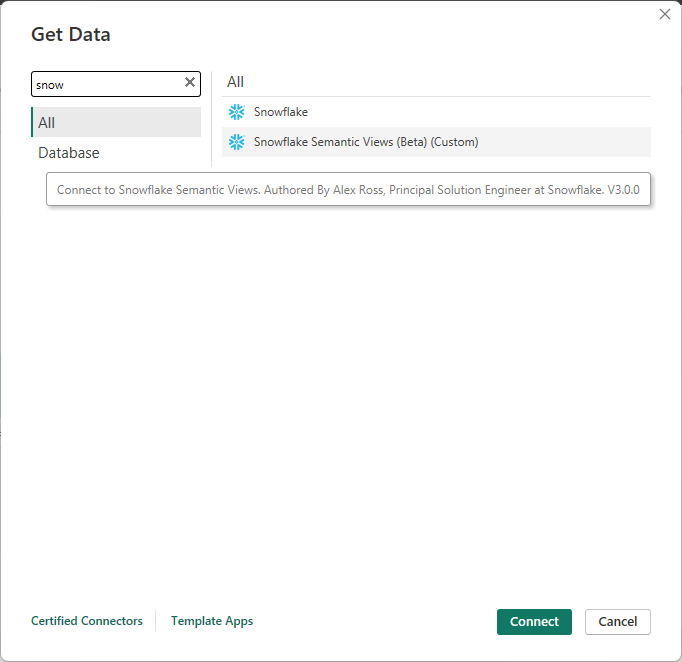

3. Enter your Snowflake server URL (e.g., `xy12345.snowflakecomputing.com`)
4. Enter your warehouse name
5. Choose your authentication method and provide credentials
6. Navigate to your database > schema > semantic view

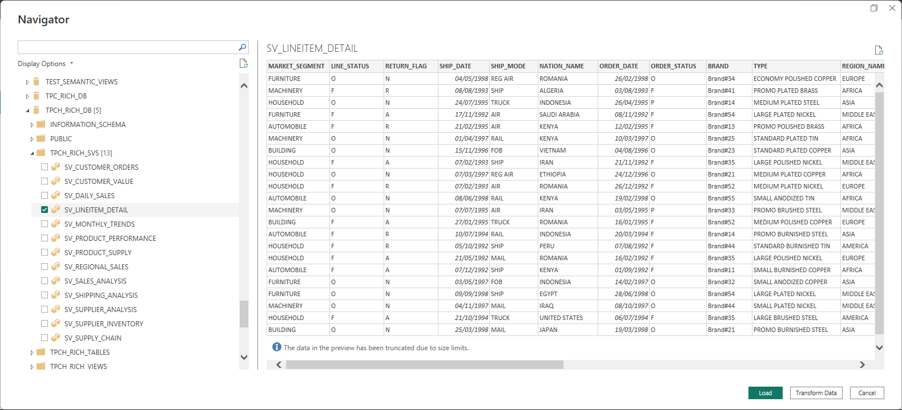

7. Select the semantic view and click **Load** or **Transform Data**

The connector automatically detects dimensions, metrics, and facts from your semantic view metadata. Just drag fields onto your report and the connector handles the SQL translation behind the scenes.

## PBIT Generator App

The `streamlit/` folder contains a companion web application that simplifies creating Power BI reports from Snowflake Semantic Views.

**What it does:**
- Connects to your Snowflake account and discovers available semantic views
- Lets you select which columns to include in your report
- Generates a ready-to-use PBIT (Power BI Template) file
- Handles the connector configuration automatically

### Workflow Overview

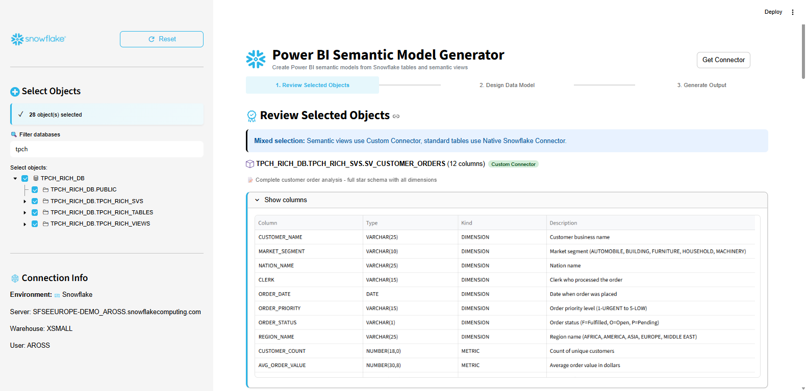
**Step 1: Review selected semantic views and their column metadata**

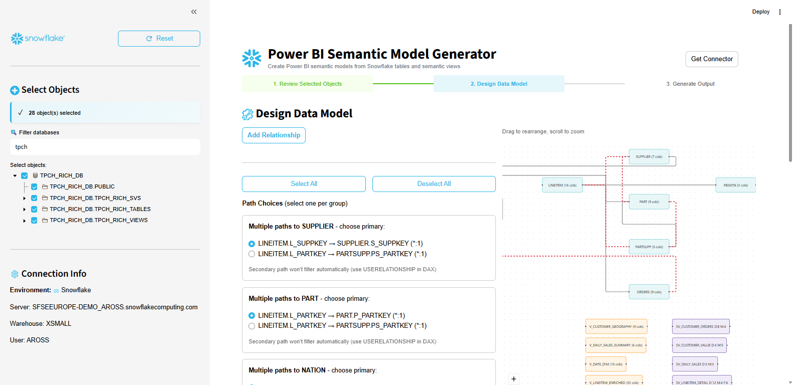
**Step 2: Design the data model and resolve relationship paths**

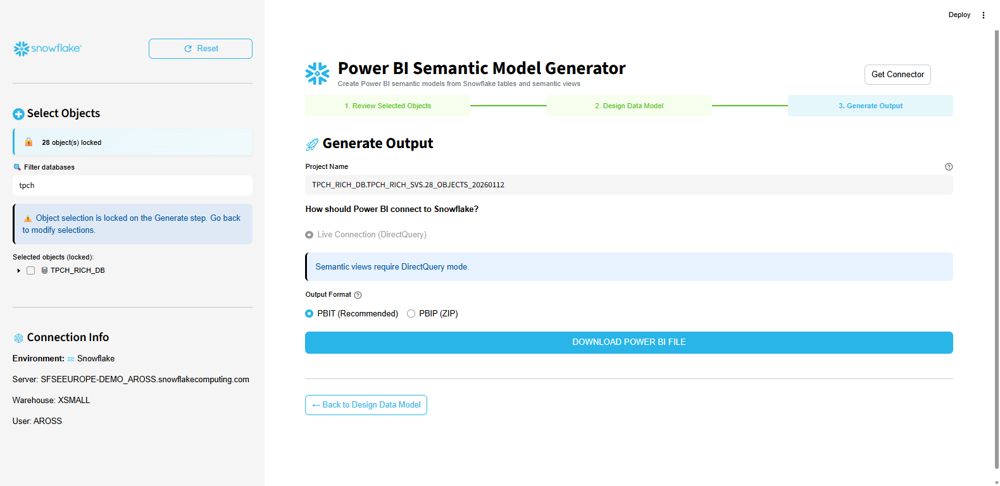
**Step 3: Generate and download the PBIT file**

### Option 1: Run Locally

For development or personal use, you can run the app on your local machine.

**Requirements:**
- Python 3.11 or higher (required for compatibility)
- pip package manager

**Steps:**
```bash
cd streamlit
pip install -r requirements.txt
streamlit run streamlit_app.py
```

The app will open in your browser at `http://localhost:8501`. You'll need to enter your Snowflake credentials each time you connect.

### Option 2: Deploy to Streamlit in Snowflake

For team or enterprise use, deploy the app directly to Snowflake where it runs securely within your Snowflake account.

**Benefits:**
- No credentials to manage (uses Snowflake's built-in authentication)
- Accessible to anyone with Snowflake access
- Runs within your Snowflake security perimeter

**Deployment Steps:**

1. Create a connections file from the template:
   ```bash
   cd streamlit
   cp deploy_connections.toml.example deploy_connections.toml
   ```

2. Edit `deploy_connections.toml` with your Snowflake account details:
   ```toml
   [default]
   account = "your-account"
   user = "your-username"
   authenticator = "externalbrowser"
   ```

3. Run the deployment script:
   ```bash
   python deploy.py --config deploy_config.yaml
   ```

4. Access the app through Snowsight under **Streamlit** in the left navigation.

**Note:** Deploying to Streamlit in Snowflake requires appropriate privileges (CREATE STREAMLIT on the target schema).

## Sample Data

The `tpch_sample_data/` folder contains SQL scripts to set up a test environment in Snowflake using the TPC-H benchmark data. These scripts create:

- Base tables with sample data
- Analytical views for common patterns
- Semantic views demonstrating various configurations

Run the scripts in order (01, 02, 03) to create a complete test environment.

## Known Limitations

### Preview Errors for Complex Semantic Views

Some semantic views may display errors in Power BI's Navigator preview pane or Power Query Editor. This is expected behavior and does not prevent the view from working.

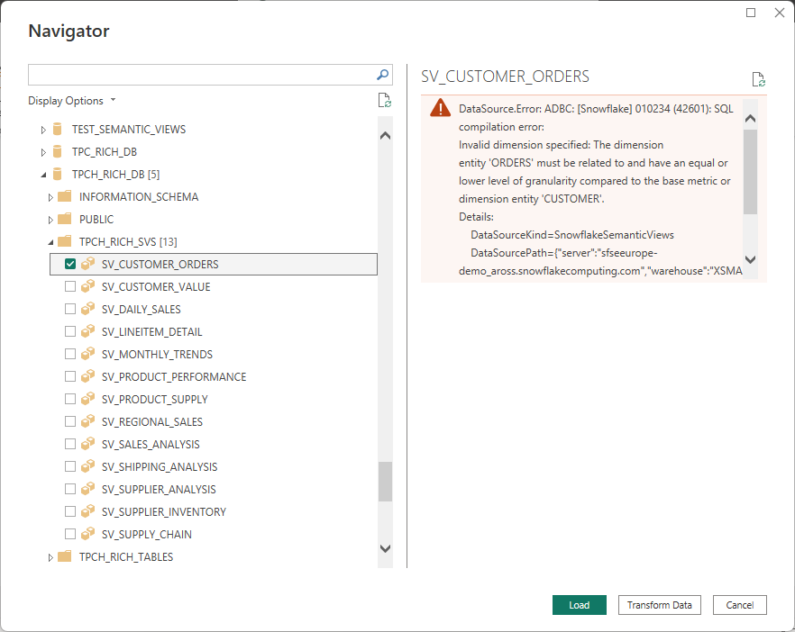
**Example: Preview error when selecting a complex semantic view**

**Why this happens:**

When Power BI previews a semantic view, it attempts to query all columns at once (`SELECT *`). Snowflake Semantic Views enforce relationship constraints—dimensions and metrics must have compatible granularity and join paths. Complex views with multiple entity relationships may have column combinations that cannot be queried together in a single statement.

For example, a semantic view might define:
- Metrics from LINEITEM (fine grain)
- Metrics from PARTSUPP (different grain)
- Dimensions from both SUPPLIER and PART paths

While each column works individually, selecting all columns simultaneously violates Snowflake's granularity rules, causing a preview error.

**The workaround:**

1. In the Navigator, click **Load** instead of previewing
2. In the data model, select only the columns you need for your report
3. Power BI will generate proper queries for your specific column selections

**Sample views with preview limitations:**

From the `tpch_sample_data/` scripts, these views may show preview errors:
- `SV_SUPPLY_CHAIN` - M:M bridge table creates granularity conflicts
- `SV_LINEITEM_DETAIL` - 7-table join with mixed entity granularity

These views work correctly in DirectQuery when you select compatible column combinations (e.g., dimensions from one path with their related metrics).

### Power BI Service and Gateway Configuration

Custom connectors require a specific workflow to work with [Power BI Service and the on-premises data gateway](https://learn.microsoft.com/en-us/power-bi/connect-data/service-gateway-onprem). You cannot create standalone gateway connections—instead, you must publish from Power BI Desktop first.

#### Prerequisites

- On-premises data gateway installed and configured
- Gateway has the `.mez` file in its Custom Connectors folder
- Gateway service restarted after adding the connector

#### Step 1: Verify Gateway Has Connector Loaded

Open the On-premises data gateway app and go to **Connectors**. Verify "SnowflakeSemanticViews" appears in the list.

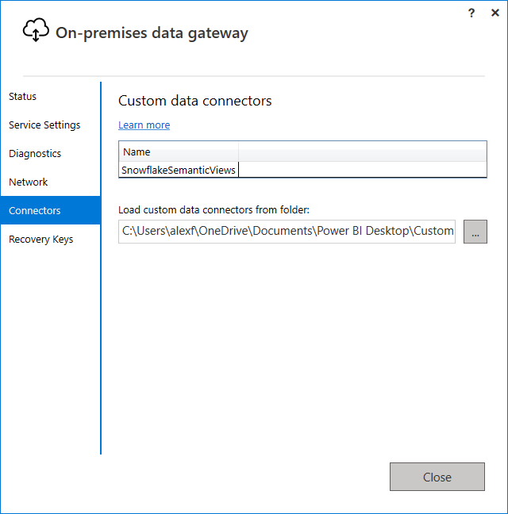

#### Step 2: Publish Report from Power BI Desktop

After creating your report in Power BI Desktop, click **Publish**. You'll see a "disconnected" message—this is expected.

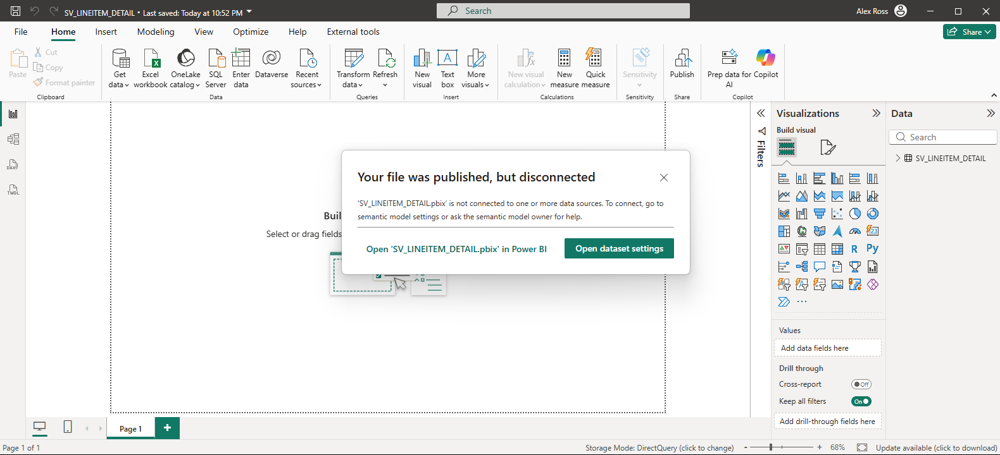

#### Step 3: Open Dataset Settings

In Power BI Service, navigate to your workspace, find the dataset, and open **Settings**. Under Gateway connection, you'll see "Not configured correctly".

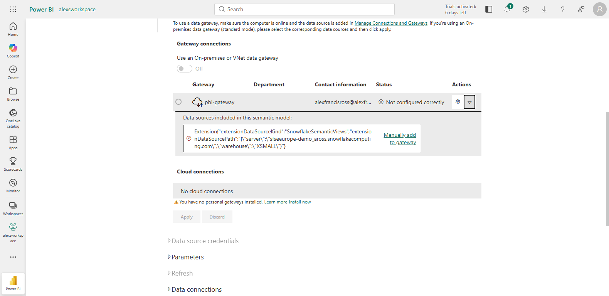

Click **Manually add to gateway** to create the connection.

#### Step 4: Configure Gateway Connection

In the Manage Connections page, configure your authentication. The connector supports UsernamePassword and KeyPair authentication for gateway connections.

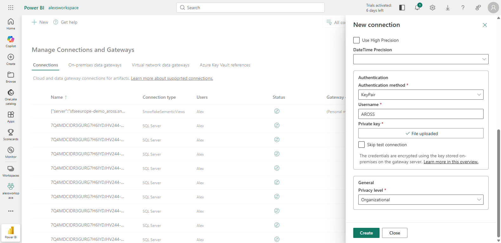

Click **Create** to save the connection.

#### Step 5: Verify Connection

Return to your dataset settings. The gateway connection should now show as configured. The dataset will refresh successfully.

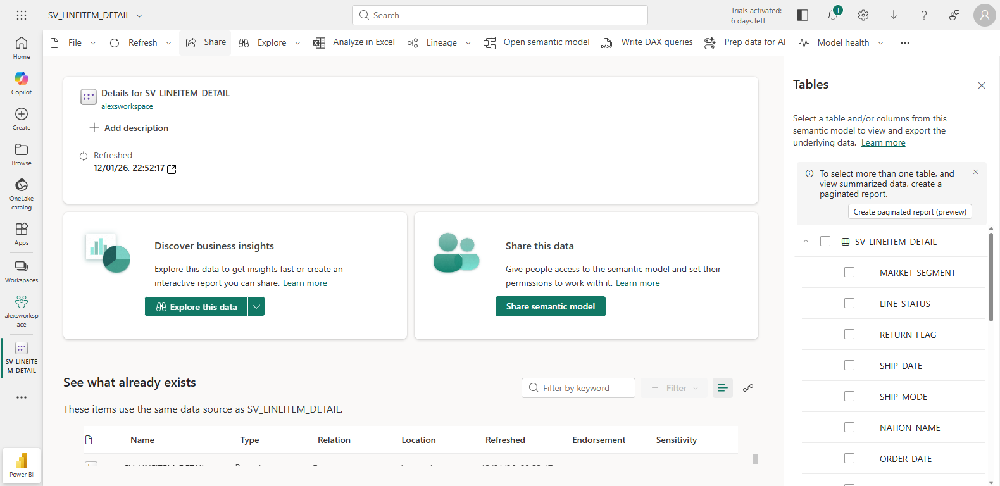

#### Step 6: Use Report in Power BI Service

Your DirectQuery report now works in Power BI Service, querying Snowflake in real-time through the gateway.

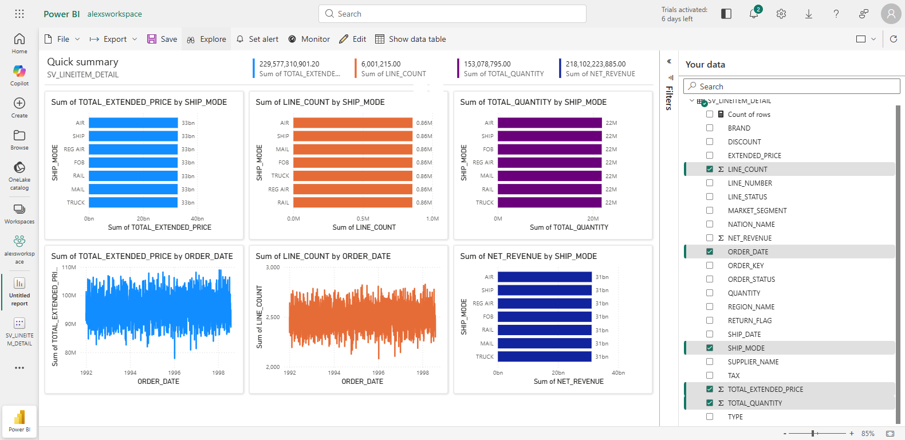

#### Step 7: Analyze in Excel (Optional)

You can also use "Analyze in Excel" to create PivotTables connected to your semantic view data.

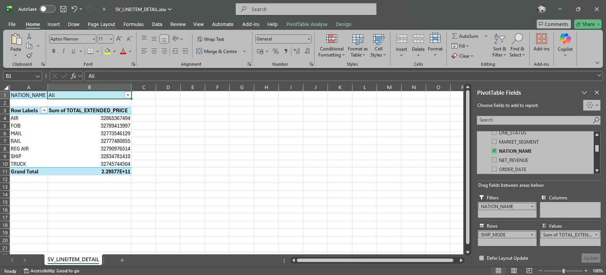

#### Troubleshooting Gateway Issues

- **Connector not appearing:** Ensure `.mez` file is in gateway's Custom Connectors folder and restart gateway service
- **"Not configured correctly":** Click "Manually add to gateway" to create the connection
- **Authentication errors:** Verify credentials work in Power BI Desktop first
- **KeyPair auth:** Upload the private key file in the connection configuration

## Troubleshooting

**Connector doesn't appear in Get Data**
- Ensure the .mez file is in the correct Custom Connectors folder
- Check that you've enabled custom connector loading in Power BI options
- Restart Power BI Desktop after installation

**Authentication errors**
- Verify your Snowflake credentials work in Snowsight or another client
- For OAuth, ensure your Snowflake account has OAuth configured
- Check that your role has access to the warehouse specified

**"Semantic view not found" errors**
- Confirm the semantic view exists and you have SELECT permissions
- Check that you're using the correct database and schema names
- Semantic Views require Snowflake Enterprise Edition or higher

**DirectQuery performance issues**
- Ensure your Snowflake warehouse is appropriately sized
- Check for complex calculations that might not fold to Snowflake
- Consider using aggregations in your semantic view definitions

**Data type mismatches**
- The connector maps Snowflake types to Power BI types automatically
- Some edge cases (like VARIANT or OBJECT types) may need manual handling
- Check the Snowflake query history if you see unexpected results

## Version

3.1.0

### Changelog

**v3.1.0** - PrivateLink Support
- Added full support for Snowflake PrivateLink URLs
- Added region detection for legacy locator format
- Enhanced server validation with PrivateLink-specific error messages

**v3.0.0** - Initial Release
- Full DirectQuery support for Snowflake Semantic Views
- PAT, OAuth, and KeyPair authentication
- PBIT Generator Streamlit app
- MSI installer for enterprise deployment

## License

MIT License

Copyright (c) 2026 Alex Ross

Permission is hereby granted, free of charge, to any person obtaining a copy
of this software and associated documentation files (the "Software"), to deal
in the Software without restriction, including without limitation the rights
to use, copy, modify, merge, publish, distribute, sublicense, and/or sell
copies of the Software, and to permit persons to whom the Software is
furnished to do so, subject to the following conditions:

The above copyright notice and this permission notice shall be included in all
copies or substantial portions of the Software.

THE SOFTWARE IS PROVIDED "AS IS", WITHOUT WARRANTY OF ANY KIND, EXPRESS OR
IMPLIED, INCLUDING BUT NOT LIMITED TO THE WARRANTIES OF MERCHANTABILITY,
FITNESS FOR A PARTICULAR PURPOSE AND NONINFRINGEMENT. IN NO EVENT SHALL THE
AUTHORS OR COPYRIGHT HOLDERS BE LIABLE FOR ANY CLAIM, DAMAGES OR OTHER
LIABILITY, WHETHER IN AN ACTION OF CONTRACT, TORT OR OTHERWISE, ARISING FROM,
OUT OF OR IN CONNECTION WITH THE SOFTWARE OR THE USE OR OTHER DEALINGS IN THE
SOFTWARE.
